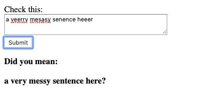

# spellchecker

## A simple spell checker written in Go


`go build`  
`./spellcheker`

```
$ curl -X POST localhost:8000/check -F "text=mistakus happon everywherre"
["mistakes","happen","everywhere"]
```


**It has a bleeding-edge frontend too**:  

---



---


## Details

It is based on the [Levenshtein distance](https://en.wikipedia.org/wiki/Levenshtein_distance).
It outputs the matrices used to calculate the distance, which are, in the above scenario:


```
     m i s t a k e s
  [0 1 2 3 4 5 6 7 8]
m [1 0 1 2 3 4 5 6 7]
i [2 1 0 1 2 3 4 5 6]
s [3 2 1 0 1 2 3 4 5]
t [4 3 2 1 0 1 2 3 4]
a [5 4 3 2 1 0 1 2 3]
k [6 5 4 3 2 1 0 1 2]
u [7 6 5 4 3 2 1 1 2]
s [8 7 6 5 4 3 2 2 1]
```

```
     h a p p e n
  [0 1 2 3 4 5 6]
h [1 0 1 2 3 4 5]
a [2 1 0 1 2 3 4]
p [3 2 1 0 1 2 3]
p [4 3 2 1 0 1 2]
o [5 4 3 2 1 1 2]
n [6 5 4 3 2 2 1]
```

```
     e v e r y w h e r e
  [0 1 2 3 4 5 6 7 8 9 10]
e [1 0 1 2 3 4 5 6 7 8 9]
v [2 1 0 1 2 3 4 5 6 7 8]
e [3 2 1 0 1 2 3 4 5 6 7]
r [4 3 2 1 0 1 2 3 4 5 6]
y [5 4 3 2 1 0 1 2 3 4 5]
w [6 5 4 3 2 1 0 1 2 3 4]
h [7 6 5 4 3 2 1 0 1 2 3]
e [8 7 6 5 4 3 2 1 0 1 2]
r [9 8 7 6 5 4 3 2 1 0 1]
r [10 9 8 7 6 5 4 3 2 1 1]
e [11 10 9 8 7 6 5 4 3 2 1]
```


